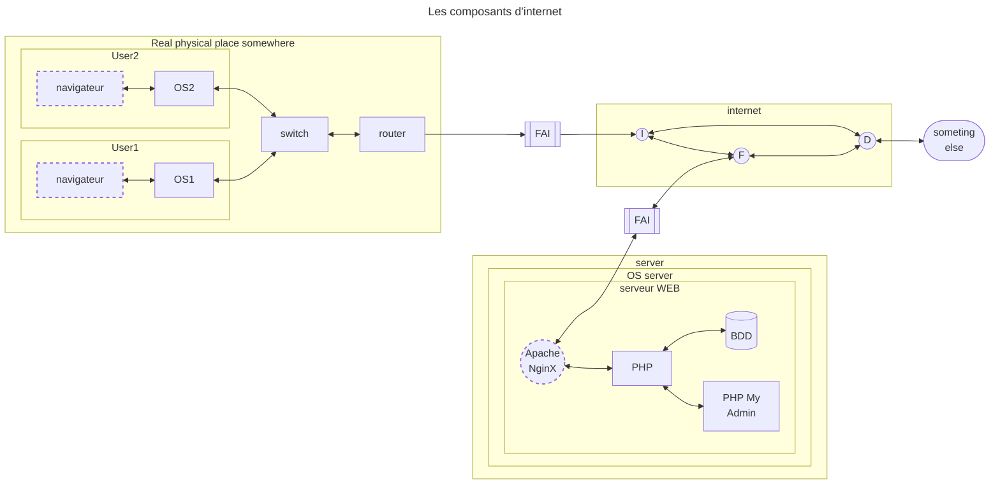
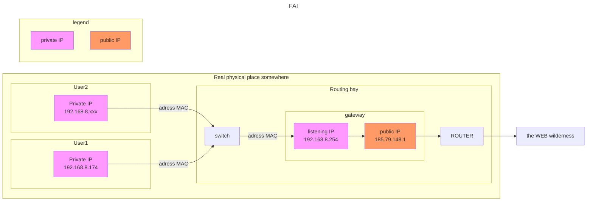
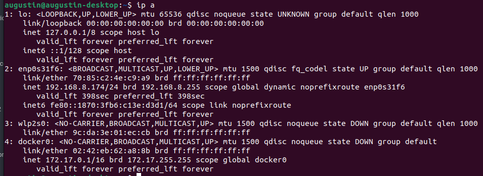

****

## Tests de connectivité et chemins
|      Commande      |                      Utilisation                       | Exemples               |
| :----------------: | :----------------------------------------------------: | ---------------------- |
|       `ip a`       | présente les cartes réseaux et leurs IP sur la machine |  |
| `whois domaine.xx` |            traduit un IP en nom de domaine             | `whois 88.198.21.14`   |
|     `nslookup`     |            traduit un nom de domaine en IP             | `whois google.fr`      |
|       `host`       |                   DNS Lookup utility                   |                        |
|    `traceroute`    | trace la route vers un IP ou un nom de domaine |                        |