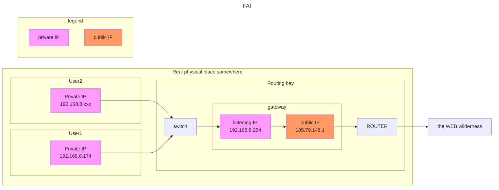

## Tests de connectivité et chemins
- Faites un test de connectivité avec le PC de votre voisin
    - Quelle est l’IP de votre poste ?

    `192.168.8.174`
    - Faits un test de connectivité IP avec framasoft.fr

    `ping framasoft.fr`
    `ping ::1` == `ping moi`
    - Quelle est la différence de temps entre les deux ?
    
    auto ping `= 0.020/0.045/0.057/0.006 ms`

    ping framasoft `= 22.854/22.960/23.202/0.059 ms`
    - Faites des tests avec d’autres serveur public et comparez les temps ?

    `ping google.com = 9.168/9.231/9.294/0.050 ms`

    `ping google.fr = 9.347/9.441/9.493/0.048 ms`

- Explorer le chemin suivi pour aller vers les quelques serveurs que vous avez explorés

    `traceroute framasoft.fr`

    - Quelles sont les points communs ? **SYNTAXE ERROR** j'ai tout de même compris des choses :

- Quelle est l’IP du premier saut ? Comment cette adresse est-elle en rapport avec votre propre IP ? Savez-vous où est cette machine ?

    L'IP du premier saut est l'IP sur laquelle nous sommes  écoutés par le **switch local** dans la **baie de routage**

## IP et Nom
- Utilisez-vous les adresses ip (sous forme numérique) lorsque vous surfez ? Pourquoi ?
    
    Non, on utilise dezs noms de domaine qui sont plus intelligibles
- Interrogez (depuis la ligne de commande) l’outil qui permet cette traduction ?
    
    `whois 255.255.99.255`
    - Faites des tests de traduction nom vers IP, puis ip vers nom

    `nslookup google.fr`
    - Expliquez ces différences

    la commande `whois` intéroge une base de données qui lie les `IP` et les `noms de domaine`

    les commandes `nslookup` et `dig` interrogent le serveur DNS
- Décrivez l’organisation générale du système de nom
    - Faites une à une les requettes (unitaire) permettant de trouver l’IP du serveur framasoft. org (3 requettes) (comme ce que fait un serveur dns pour vous)